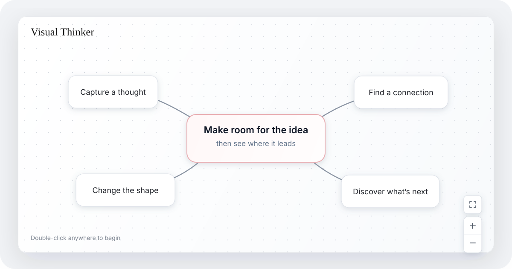

<p align="center">
  
</p>

<h1 align="center">Visual Thinker</h1>

<p align="center">
  a neural network inspired visual brainstorming and discovery tool for your agents to drive and you to tweak
</p>

<p align="center">
  <a href="https://visual-thinker.pages.dev/"><strong>Open Visual Thinker</strong></a>
  ·
  <a href="https://github.com/PlaygrndLabs/visual-thinker/issues">Share feedback</a>
</p>

<p align="center">
  
</p>

Visual Thinker is an immediate, full-screen workspace for ideas that are easier to understand spatially. Put down a thought, connect it to another, move things around, and let the shape of the canvas help you discover what comes next.

There are no files to organize or modes to learn. The interface stays quiet, your work saves in the browser, and the canvas gets out of the way.

## Think in space

- **Capture without ceremony.** Double-click anywhere to create an idea and start typing.
- **Make relationships visible.** Drag between ideas to connect them; connections reroute as the canvas changes.
- **Rearrange freely.** Move one thought or an entire selection until the structure makes sense.
- **Stay in flow.** Copy, paste, cut, undo, redo, zoom, and pan with familiar desktop gestures.
- **Return where you left off.** Ideas and viewport state persist locally in your browser.

## Think with an agent through WebMCP

Visual Thinker is a strong fit for [WebMCP](https://github.com/webmachinelearning/webmcp) because its value lives in a shared, visual workspace. The user and agent need to see and shape the same ideas, connections, and spatial relationships—not exchange a hidden document through a separate backend.

Without WebMCP, an agent has to infer the canvas from screenshots or the DOM and simulate a long sequence of pointer interactions. Visual Thinker instead exposes its existing client-side canvas actions as structured tools. The agent can make precise, reliable changes in the open tab while the user watches, adjusts the result directly, and uses the same undo history.

This makes workflows possible that are awkward with either chat or manual diagramming alone. A person can describe the structure they want in natural language; the agent can inspect the current canvas, build or reorganize a mind map in batches, and connect related ideas; then the person can immediately move, edit, or undo anything on the canvas. Both stay grounded in one visible source of truth.

### Available tools

| Tool | What it enables |
| --- | --- |
| `inspect_canvas` | Read paginated ideas and connections, plus the visible canvas bounds. |
| `create_ideas` | Add a batch of ideas at explicit canvas coordinates. |
| `update_ideas` | Edit idea text and positions in a batch. |
| `connect_ideas` | Add unique, undirected connections between ideas. |
| `disconnect_ideas` | Remove connections between idea pairs. |
| `delete_ideas` | Remove ideas and their incident connections. |

Each mutation is one undoable canvas change and follows the same state, history, connection, and `localStorage` persistence paths as direct human interaction. Inputs are validated with Zod, the WebMCP input JSON Schemas are generated from those definitions, read results identify user-authored text as untrusted content, and browsers without WebMCP continue to get the complete human interface.

The React integration registers tools for the lifetime of the canvas and unregisters them with an `AbortController`. In simplified form, the implementation in [`src/hooks/use-webmcp-tools.js`](src/hooks/use-webmcp-tools.js) follows this shape:

```js
document.modelContext.registerTool({
  name: 'create_ideas',
  description:
    'Create one or more non-empty ideas at explicit absolute canvas coordinates in one undoable change.',
  inputSchema: getInputSchema(createIdeasInputSchema),
  annotations: {
    consequentialHint: false,
    readOnlyHint: false,
    untrustedContentHint: false,
  },
  execute(input) {
    const { ideas } = parseInput(
      'create_ideas',
      createIdeasInputSchema,
      input,
    )

    // Apply the validated batch through the app's canvas update path,
    // then return the generated idea IDs to the agent.
  },
}, { signal: controller.signal })
```

## Essential gestures

| Intent | Mouse or trackpad | Keyboard |
| --- | --- | --- |
| Add an idea | Double-click empty canvas | `N` |
| Edit an idea | Double-click an idea | `Enter` finishes editing |
| Connect ideas | Drag from an idea edge into another idea | — |
| Select ideas | Click or drag a selection rectangle | `Shift`-click to add; `⌘/Ctrl+A` for all |
| Move around | Trackpad, middle-drag, or `Space`-drag | Hold `Space` while dragging |
| Zoom | Mouse wheel or `⌘/Ctrl` + scroll | Use the corner controls |
| Remove | Double-click a connection | `Backspace` / `Delete` for a selection |
| Undo / redo | — | `⌘/Ctrl+Z` / `⌘/Ctrl+Shift+Z` |

Right-click an idea, connection, or empty canvas for actions that fit the current selection.

## Run it locally

Visual Thinker uses [Bun](https://bun.sh/) for dependencies and scripts.

```bash
git clone https://github.com/PlaygrndLabs/visual-thinker.git
cd visual-thinker
make setup
make dev
```

Vite will print the local URL. To prefer a particular port:

```bash
PORT=4317 make dev
```

## Build

```bash
bun run lint
bun run build
```

The production bundle is written to `dist/`.

## Under the canvas

Visual Thinker is built with React 19, React Flow, Tailwind CSS 4, shadcn, Zod, and Vite. Canvas content, interaction familiarity, and viewport state are schema-validated before being stored in browser `localStorage`.

Every push to `main` is deployed automatically to [Cloudflare Pages](https://visual-thinker.pages.dev/). Other branches and pull requests receive preview deployments.

## Contributing

Ideas, bug reports, and focused pull requests are welcome. Start with an [issue](https://github.com/PlaygrndLabs/visual-thinker/issues) when a change would benefit from a little design discussion first.

## License

Visual Thinker is open source under the [MIT License](LICENSE). © 2026 PlaygrndLabs.
